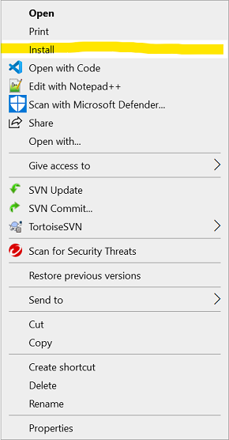
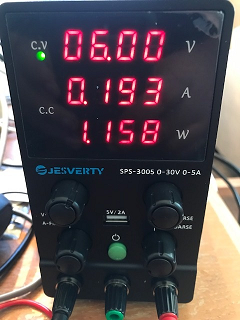
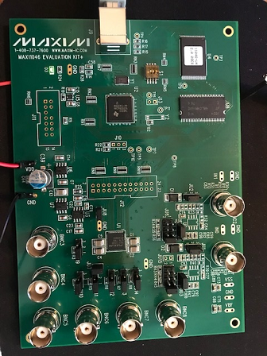
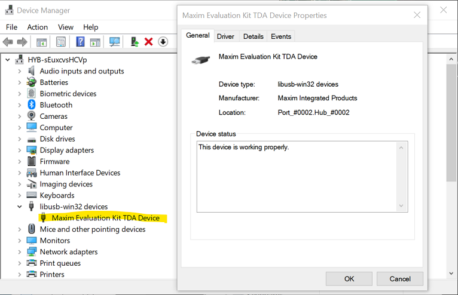
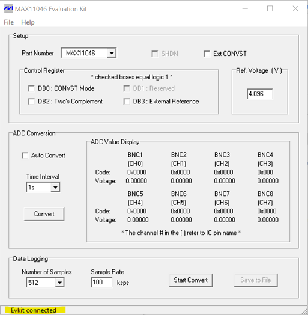

## Description

This group of files is a patch of the MAX11046EVKIT software to allow the main program, MAX11046.exe, to run on Windows 10. The patch must be applied by hand.  See below for the instructions. If the patch is applied correctly, it will install an updated, signed, open-source device driver known as "libusb-win32" that allows the main program and the evaluation kit board to communicate through USB. The original evaluation kit software installed an older, unsigned version of the device driver that does not run on Windows 10.  After being patched, the MAX11046EVKIT software can then be used to exercise the following chips:  the MAX11044, MAX11045, MAX11046, MAX11047, MAX11048, and MAX11049.

Please note that the instructions below assume that the MAX11046EVKIT software has already been downloaded and installed.  The download link is listed on the evaluation kit's [main quickview page](https://www.maximintegrated.com/en/products/analog/data-converters/analog-to-digital-converters/MAX11046EVKIT.html). Look for the link under the title "Software Support". 

## MAX11046EVKIT LIBUSB Driver Patch Instructions (Windows 10 x64):
1. Make sure no MAX11046EVKIT boards are connected to a USB port.  If one is plugged in, please unplug it. 
2. Right-click on the Maxim_Evaluation_Kit_TDA_Device.inf file.  From the pop-up menu click on "Install". This will copy the correct libusb files into your system files and associate them with the MAX11046EVKIT board the next time the board is plugged into the computer.
  
    

4. Power-up the MAX11046EVKIT.  It requires an external 6V-8V DC power supply.

    

5. Plug in the MAX11046EVKIT into a spare USB port with the supplied cable.  As mentioned in Step 2, this will install the libusb files and device driver.

    

6. To verify libusb has been installed, open Device Manager. You can do this by right-clicking the Windows Start button and clicking on the "Device Manager" menu item. The device should now show up under the "libusb-win32 devices" category as "Maxim Evaluation Kit TDA Device." A simple double-click should display a window showing a Device Status of "This device is working properly."

    

7. Navigate to the C:\Program Files\MAX11046 directory and delete all files except the MAX11046.EXE and the "Uninst.ini" files from the directory.

    

8. The MAX11046.EXE program should now connect to the MAX11046EVKIT and function correctly.

    

## Licenses
1.  The *.inf and *.cat files fall under the license reported in the license.txt file in this directory.
2.  The libusb0.dll library file is distributed under the terms of the GNU Lesser General Public License (LGPL http://www.gnu.org/licenses/licenses.html#LGPL). It can also be found in the /license/license.txt file.
3.  The libusb0.sys device driver file is distributed under the terms of the GNU General Public License (GPL http://www.gnu.org/licenses/licenses.html#GPL). It can also be found in the /license/license.txt file.